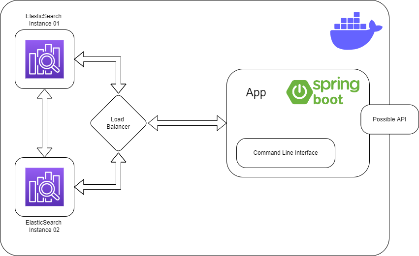

[](https://www.oracle.com/java/technologies/java8.html)
[](https://spring.io/)
[](https://www.codacy.com/gh/reiballa/documentSearchEngine/dashboard?utm_source=github.com&amp;utm_medium=referral&amp;utm_content=reiballa/documentSearchEngine&amp;utm_campaign=Badge_Grade)
# Scalable document search engine using Spring & Elasticsearch 
## App Architecture
This is a simple CLI application that saves a document comprising an id and a list of tokens, as well as query said documents in a timely manner.



This solution is based on scalability and expandability. In the Docker container there are 4 main parts: 
Two Elasticsearch instances, a load balancer to distribute the load evenly between them and finally 
a spring boot application containing the CLI needed to interact wit the application. Ideally we would need another 
entrypoint, communicating with the app via REST or messaging.

Docker Compose is used to configure the cluster.
It uses a shared network to make it possible for the nodes to communicate with the load-balancer
and with each other for synchronization.
Components of the cluster are listed below:
* load-balancer:80 exposed on port 80 to the host machine
* es01:9200 exposed on port 9200
* es02:9201 exposed on port 9200 
* spring boot app

After the spring boot app is started, all the needed beans are created and the CLI becomes 
available to the user. Below are the supported commands:
* help : prints helpful info on each command
* index : uses elasticsearch repository to add a document to the index
* query : uses elasticsearch repository to get the document ids which match the query expression
* quit : exit the application

## Next stepts
As hinted by the diagram, A next step for this app would be to move the CLI app outside the docker network 
environment, and offer the commands of the spring boot app via REST API. Spring is not really designed for CLI 
applications, so it would be better to have that separately.

## Requirements
JDK 8+

Apache Maven 3+

Docker

## Running the Application

Before running anything, you might need to increase the max vm memory size in docker. To do this in windows run the following commands:
```
wsl -d docker-desktop
```
and then: 
```
sysctl -w vm.max_map_count=262144
```

Navigate to the root folder of the project and run the following commands:
Start a cluster of three ElasticSearch nodes with Docker Compose
```
docker-compose up -d
```
Create the application image using Docker Build
```
docker build -t search-engine-app .
```
Start the application using Docker Run
```
docker run --rm -it --network searchengine_elastic search-engine-app
```
